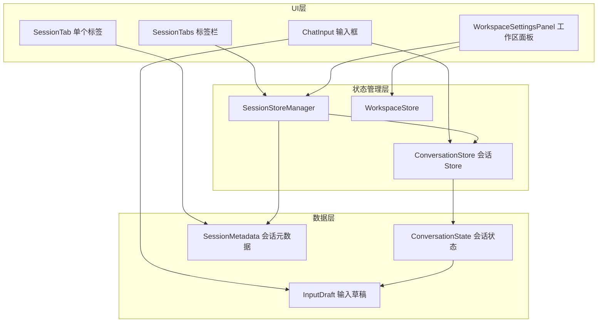
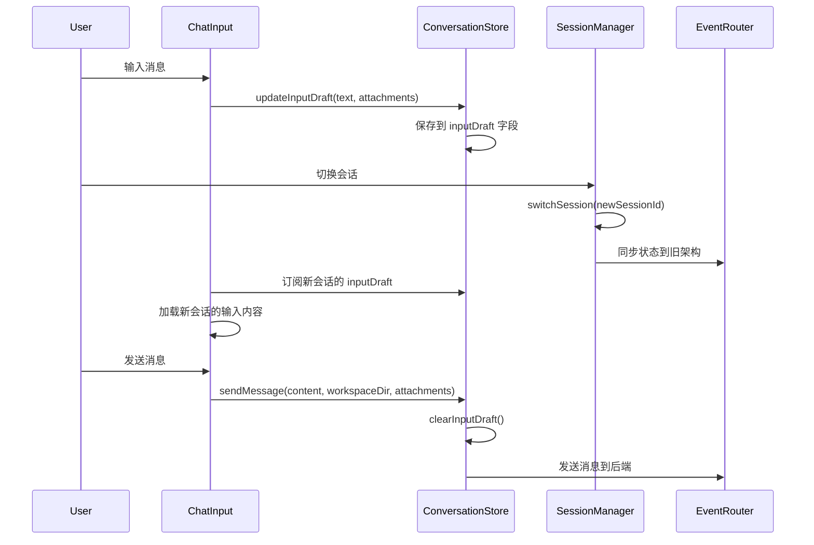

# 设计文档 - 会话标签页增强功能

## 概述

本设计文档描述了会话标签页（Session Tabs）功能的增强实现方案。该功能旨在解决当前多会话标签页系统中的四个核心问题：

1. **工作区管理功能缺失** - 标签页缺少工作区相关的增删改查设置功能
2. **消息实时显示问题** - 发送消息后标签页不会实时显示用户消息（已实现，需验证）
3. **发送按钮状态不同步** - 发送按钮不会变红，无法显示中断按钮（架构不一致导致）
4. **输入框没有会话隔离** - 会话切换时输入内容会丢失

### 设计目标

- 提供完整的工作区管理界面，支持在标签页中设置和切换工作区
- 确保消息发送后立即在当前标签页显示
- 修复架构不一致问题，确保发送按钮状态正确同步
- 实现输入框会话隔离，每个会话保留独立的输入内容和附件
- 自动传递工作区上下文到后端 API

### 技术栈

- **状态管理**: Zustand (ConversationStore, SessionStoreManager)
- **UI 框架**: React + TypeScript
- **样式**: Tailwind CSS
- **事件系统**: EventRouter (会话隔离的事件分发)

## 架构

### 整体架构



### 架构不一致问题分析

当前系统存在新旧架构并存的问题：

**旧架构 (EventChatStore)**:
- App.tsx 使用 `useEventChatStore` 获取 `isStreaming` 状态
- 单一全局状态，不支持多会话

**新架构 (ConversationStore + SessionStoreManager)**:
- `sendMessage` 和 `interrupt` 使用 `useActiveSessionActions`
- 每个会话独立的 Store 实例
- 支持多会话并行

**问题根源**:
- App.tsx 中的 `isStreaming` 来自旧架构，而 `sendMessage` 来自新架构
- 当新架构更新 `isStreaming` 时，旧架构的状态不会同步更新
- 导致 ChatInput 无法正确显示中断按钮

**解决方案**:
- 统一使用新架构的 hooks: `useActiveSessionStreaming()`
- 移除对 `useEventChatStore` 的直接依赖
- 通过 SessionStoreManager 的事件分发机制自动同步状态

### 会话隔离机制



## 组件和接口

### 1. ConversationState 扩展

在现有的 `ConversationState` 中添加输入草稿和工作区关联：

```typescript
export interface ConversationState {
  // ... 现有字段 ...
  
  // 新增：输入草稿
  inputDraft: {
    text: string
    attachments: Attachment[]
  }
  
  // 新增：工作区关联
  workspaceId: string | null
}
```

### 2. SessionMetadata 扩展

在现有的 `SessionMetadata` 中添加工作区信息：

```typescript
export interface SessionMetadata {
  // ... 现有字段 ...
  
  // 已有：工作区 ID
  workspaceId: string | null
  
  // 新增：工作区名称（用于显示）
  workspaceName?: string
}
```

### 3. WorkspaceSettingsPanel 组件

新建工作区设置面板组件：

```typescript
interface WorkspaceSettingsPanelProps {
  sessionId: string
  currentWorkspaceId: string | null
  onClose: () => void
}

export function WorkspaceSettingsPanel({
  sessionId,
  currentWorkspaceId,
  onClose
}: WorkspaceSettingsPanelProps) {
  // 显示当前工作区
  // 显示所有可用工作区列表
  // 提供选择工作区功能
  // 提供"无工作区"选项
  // 提供创建新工作区入口
}
```

### 4. SessionTab 组件增强

在现有的 `SessionTab` 组件中添加工作区名称显示：

```typescript
export const SessionTab = memo(function SessionTab({
  session,
  isActive,
  onSelect,
  onClose,
  canClose,
}: SessionTabProps) {
  // ... 现有代码 ...
  
  // 新增：显示工作区名称
  const workspaceName = session.workspaceName
  
  return (
    <div>
      {/* 状态指示器 */}
      <StatusDot status={mapSessionStatus(session.status)} size="sm" />
      
      {/* 标题 */}
      <span>{session.title}</span>
      
      {/* 新增：工作区名称 */}
      {workspaceName && (
        <span className="text-xs text-text-tertiary">
          {workspaceName}
        </span>
      )}
      
      {/* 关闭按钮 */}
    </div>
  )
})
```

### 5. ChatInput 组件增强

修改 `ChatInput` 组件以支持输入草稿：

```typescript
export function ChatInput({
  onSend,
  disabled,
  isStreaming,
  onInterrupt,
}: ChatInputProps) {
  // 移除内部 useState，改用 Store
  // const [value, setValue] = useState('')
  // const [attachments, setAttachments] = useState<Attachment[]>([])
  
  // 新增：订阅活跃会话的输入草稿
  const inputDraft = useActiveSessionInputDraft()
  const { updateInputDraft, clearInputDraft } = useActiveSessionActions()
  
  // 使用 Store 中的值
  const value = inputDraft.text
  const attachments = inputDraft.attachments
  
  // 输入变化时更新 Store（防抖）
  const handleInputChange = useDebouncedCallback((newValue: string) => {
    updateInputDraft({ text: newValue, attachments })
  }, 300)
  
  // 发送消息时清空草稿
  const handleSend = useCallback(() => {
    onSend(value, undefined, attachments)
    clearInputDraft()
  }, [value, attachments, onSend, clearInputDraft])
}
```

### 6. 新增 Hooks

#### useActiveSessionInputDraft

订阅活跃会话的输入草稿：

```typescript
export function useActiveSessionInputDraft() {
  return useActiveSessionSelector(
    useCallback((state: ConversationState) => state.inputDraft, []),
    { text: '', attachments: [] }
  )
}
```

#### useActiveSessionWorkspace

获取活跃会话关联的工作区：

```typescript
export function useActiveSessionWorkspace() {
  const workspaceId = useActiveSessionSelector(
    useCallback((state: ConversationState) => state.workspaceId, []),
    null
  )
  
  const workspace = useWorkspaceStore(
    useCallback((state) => 
      workspaceId ? state.workspaces.find(w => w.id === workspaceId) : null,
    [workspaceId])
  )
  
  return workspace
}
```

## 数据模型

### InputDraft 数据结构

```typescript
interface InputDraft {
  text: string
  attachments: Attachment[]
}

interface Attachment {
  id: string
  type: 'image' | 'file'
  fileName: string
  fileSize: number
  mimeType: string
  content: string // base64 编码
  preview?: string // 图片预览 URL
}
```

### SessionMetadata 完整结构

```typescript
interface SessionMetadata {
  id: string
  title: string
  type: 'project' | 'free'
  workspaceId: string | null
  workspaceName?: string // 用于显示
  status: 'idle' | 'running' | 'waiting' | 'error' | 'background-running'
  createdAt: string
  updatedAt: string
}
```

### ConversationState 完整结构

```typescript
interface ConversationState {
  // 消息状态
  messages: ChatMessage[]
  archivedMessages: ChatMessage[]
  currentMessage: CurrentAssistantMessage | null
  
  // 流式构建映射
  toolBlockMap: Map<string, number>
  questionBlockMap: Map<string, number>
  planBlockMap: Map<string, number>
  activePlanId: string | null
  agentRunBlockMap: Map<string, number>
  activeTaskId: string | null
  toolGroupBlockMap: Map<string, number>
  pendingToolGroup: PendingToolGroup | null
  permissionRequestBlockMap: Map<string, number>
  activePermissionRequestId: string | null
  streamingUpdateCounter: number
  
  // 会话状态
  conversationId: string | null
  currentConversationSeed: string | null
  isStreaming: boolean
  error: string | null
  progressMessage: string | null
  providerSessionCache: ProviderSessionCache | null
  
  // 新增：输入草稿
  inputDraft: InputDraft
  
  // 新增：工作区关联
  workspaceId: string | null
  
  // 元数据
  sessionId: string
}
```

## 错误处理

### 1. 工作区不存在

**场景**: 用户切换到一个已删除的工作区

**处理**:
- 检测到工作区不存在时，自动将会话转换为自由会话模式
- 显示通知："工作区已删除，已切换到自由会话模式"
- 更新 SessionMetadata: `workspaceId = null`, `type = 'free'`

### 2. 工作区路径无效

**场景**: 工作区路径不存在或无权限访问

**处理**:
- 在 `sendMessage` 时验证工作区路径
- 如果路径无效，显示错误："工作区路径无效，请检查工作区设置"
- 不发送消息，保留用户输入

### 3. 输入草稿恢复失败

**场景**: 从 sessionStorage 恢复输入草稿时解析失败

**处理**:
- 捕获 JSON 解析错误
- 使用空草稿作为默认值
- 记录警告日志，不影响用户体验

### 4. 会话切换时的状态同步失败

**场景**: 切换会话时，新会话的状态同步到旧架构失败

**处理**:
- 捕获同步错误，记录警告日志
- 继续完成会话切换
- 新架构的状态仍然正确，只是旧架构可能不同步

## 测试策略

### 单元测试

由于该功能主要涉及 UI 状态管理和组件交互，不适合使用 Property-Based Testing。我们将使用传统的单元测试和集成测试策略。

#### 1. ConversationStore 测试

测试输入草稿管理：

```typescript
describe('ConversationStore - Input Draft', () => {
  it('should update input draft', () => {
    const store = createConversationStore('test-session', mockDeps)
    store.getState().updateInputDraft({ text: 'Hello', attachments: [] })
    expect(store.getState().inputDraft.text).toBe('Hello')
  })
  
  it('should clear input draft on send', () => {
    const store = createConversationStore('test-session', mockDeps)
    store.getState().updateInputDraft({ text: 'Hello', attachments: [] })
    store.getState().sendMessage('Hello')
    expect(store.getState().inputDraft.text).toBe('')
  })
  
  it('should preserve input draft on session switch', () => {
    const manager = sessionStoreManager.getState()
    const sessionId1 = manager.createSession({ type: 'free' })
    const sessionId2 = manager.createSession({ type: 'free' })
    
    const store1 = manager.getStore(sessionId1)
    store1?.updateInputDraft({ text: 'Draft 1', attachments: [] })
    
    manager.switchSession(sessionId2)
    manager.switchSession(sessionId1)
    
    expect(store1?.inputDraft.text).toBe('Draft 1')
  })
})
```

#### 2. SessionStoreManager 测试

测试工作区关联：

```typescript
describe('SessionStoreManager - Workspace Association', () => {
  it('should create session with workspace', () => {
    const manager = sessionStoreManager.getState()
    const sessionId = manager.createSession({
      type: 'project',
      workspaceId: 'workspace-1'
    })
    
    const metadata = manager.sessionMetadata.get(sessionId)
    expect(metadata?.workspaceId).toBe('workspace-1')
  })
  
  it('should update workspace association', () => {
    const manager = sessionStoreManager.getState()
    const sessionId = manager.createSession({ type: 'free' })
    
    manager.updateSessionWorkspace(sessionId, 'workspace-1')
    
    const metadata = manager.sessionMetadata.get(sessionId)
    expect(metadata?.workspaceId).toBe('workspace-1')
    expect(metadata?.type).toBe('project')
  })
  
  it('should convert to free session when workspace is removed', () => {
    const manager = sessionStoreManager.getState()
    const sessionId = manager.createSession({
      type: 'project',
      workspaceId: 'workspace-1'
    })
    
    manager.updateSessionWorkspace(sessionId, null)
    
    const metadata = manager.sessionMetadata.get(sessionId)
    expect(metadata?.workspaceId).toBeNull()
    expect(metadata?.type).toBe('free')
  })
})
```

#### 3. ChatInput 组件测试

测试输入草稿订阅：

```typescript
describe('ChatInput - Input Draft', () => {
  it('should load input draft from active session', () => {
    const { result } = renderHook(() => useActiveSessionInputDraft())
    
    act(() => {
      const { updateInputDraft } = useActiveSessionActions()
      updateInputDraft({ text: 'Test', attachments: [] })
    })
    
    expect(result.current.text).toBe('Test')
  })
  
  it('should clear input draft on send', () => {
    const { result } = renderHook(() => ({
      draft: useActiveSessionInputDraft(),
      actions: useActiveSessionActions()
    }))
    
    act(() => {
      result.current.actions.updateInputDraft({ text: 'Test', attachments: [] })
    })
    
    act(() => {
      result.current.actions.sendMessage('Test')
    })
    
    expect(result.current.draft.text).toBe('')
  })
})
```

### 集成测试

#### 1. 会话切换流程

测试完整的会话切换流程，包括输入草稿保留：

```typescript
describe('Session Switch Integration', () => {
  it('should preserve input draft when switching sessions', async () => {
    // 创建两个会话
    const session1 = createSession({ type: 'free' })
    const session2 = createSession({ type: 'free' })
    
    // 在会话1中输入内容
    switchSession(session1)
    updateInputDraft({ text: 'Draft 1', attachments: [] })
    
    // 切换到会话2
    switchSession(session2)
    updateInputDraft({ text: 'Draft 2', attachments: [] })
    
    // 切换回会话1
    switchSession(session1)
    
    // 验证草稿保留
    const draft = getInputDraft()
    expect(draft.text).toBe('Draft 1')
  })
})
```

#### 2. 工作区关联流程

测试工作区关联和上下文传递：

```typescript
describe('Workspace Association Integration', () => {
  it('should send message with workspace context', async () => {
    // 创建会话并关联工作区
    const sessionId = createSession({
      type: 'project',
      workspaceId: 'workspace-1'
    })
    
    // 发送消息
    await sendMessage('Test message')
    
    // 验证后端调用包含工作区路径
    expect(mockInvoke).toHaveBeenCalledWith('start_chat', {
      message: 'Test message',
      options: expect.objectContaining({
        workDir: '/path/to/workspace-1'
      })
    })
  })
})
```

### 端到端测试

使用 Playwright 测试完整的用户流程：

```typescript
test('user can manage workspace in session tab', async ({ page }) => {
  // 打开应用
  await page.goto('/')
  
  // 点击工作区管理按钮
  await page.click('[data-testid="workspace-settings-button"]')
  
  // 选择工作区
  await page.click('[data-testid="workspace-option-1"]')
  
  // 验证标签页显示工作区名称
  const workspaceName = await page.textContent('[data-testid="session-workspace-name"]')
  expect(workspaceName).toBe('My Workspace')
  
  // 发送消息
  await page.fill('[data-testid="chat-input"]', 'Test message')
  await page.click('[data-testid="send-button"]')
  
  // 验证消息发送成功
  await page.waitForSelector('[data-testid="user-message"]')
})
```

### 测试覆盖率目标

- 单元测试覆盖率: ≥ 80%
- 集成测试覆盖率: ≥ 70%
- 端到端测试: 覆盖所有主要用户流程

## 实现计划

### Phase 1: 数据模型扩展

1. 扩展 `ConversationState` 添加 `inputDraft` 和 `workspaceId` 字段
2. 扩展 `SessionMetadata` 添加 `workspaceName` 字段
3. 更新 `createConversationStore` 初始化逻辑

### Phase 2: 输入草稿功能

1. 实现 `updateInputDraft` 和 `clearInputDraft` 方法
2. 创建 `useActiveSessionInputDraft` hook
3. 修改 `ChatInput` 组件使用 Store 中的输入草稿
4. 实现防抖更新机制

### Phase 3: 工作区管理

1. 创建 `WorkspaceSettingsPanel` 组件
2. 在 `SessionTabs` 中添加工作区管理入口
3. 实现工作区选择和关联逻辑
4. 在 `SessionTab` 中显示工作区名称

### Phase 4: 架构统一

1. 修改 `App.tsx` 使用 `useActiveSessionStreaming()`
2. 移除对 `useEventChatStore` 的直接依赖
3. 验证发送按钮状态同步正确

### Phase 5: 测试和优化

1. 编写单元测试
2. 编写集成测试
3. 性能优化（防抖、缓存）
4. 用户体验优化

## 性能考虑

### 1. 输入草稿更新防抖

使用 300ms 防抖避免频繁更新 Store：

```typescript
const handleInputChange = useDebouncedCallback((newValue: string) => {
  updateInputDraft({ text: newValue, attachments })
}, 300)
```

### 2. 会话切换优化

会话切换时只同步必要的状态到旧架构：

```typescript
switchSession: (sessionId: string) => {
  // ... 切换逻辑 ...
  
  // 只同步关键状态
  useEventChatStore.setState({
    messages: storeState.messages,
    currentMessage: storeState.currentMessage,
    isStreaming: storeState.isStreaming,
    error: storeState.error,
  })
}
```

### 3. 工作区名称缓存

在 `SessionMetadata` 中缓存工作区名称，避免每次渲染都查询：

```typescript
const metadata: SessionMetadata = {
  // ... 其他字段 ...
  workspaceId: options.workspaceId || null,
  workspaceName: options.workspaceId 
    ? workspaceStore.getWorkspaceById(options.workspaceId)?.name 
    : undefined
}
```

## 安全考虑

### 1. 输入草稿持久化

输入草稿存储在 sessionStorage 中，浏览器关闭后自动清除，避免敏感信息泄露。

### 2. 工作区路径验证

在发送消息前验证工作区路径，防止路径遍历攻击：

```typescript
const validateWorkspacePath = (path: string): boolean => {
  // 检查路径是否在允许的工作区列表中
  const workspaces = useWorkspaceStore.getState().workspaces
  return workspaces.some(w => w.path === path)
}
```

### 3. 附件大小限制

限制附件总大小，防止内存溢出：

```typescript
const MAX_TOTAL_ATTACHMENT_SIZE = 10 * 1024 * 1024 // 10MB

const validateAttachments = (attachments: Attachment[]): boolean => {
  const totalSize = attachments.reduce((sum, a) => sum + a.fileSize, 0)
  return totalSize <= MAX_TOTAL_ATTACHMENT_SIZE
}
```

## 可访问性

### 1. 键盘导航

- 标签页支持 Tab 键导航
- 工作区设置面板支持 Esc 键关闭
- 输入框支持 Ctrl+Enter 发送消息

### 2. 屏幕阅读器

- 标签页使用 `role="tab"` 和 `aria-selected`
- 工作区设置面板使用 `role="dialog"` 和 `aria-labelledby`
- 状态指示器使用 `aria-label` 描述状态

### 3. 颜色对比度

- 状态指示器颜色符合 WCAG AA 标准
- 工作区名称使用足够的对比度

## 国际化

所有用户可见的文本都使用 i18n 翻译：

```typescript
const { t } = useTranslation('session')

// 工作区设置面板
t('session.workspaceSettings.title') // "工作区设置"
t('session.workspaceSettings.current') // "当前工作区"
t('session.workspaceSettings.select') // "选择工作区"
t('session.workspaceSettings.none') // "无工作区"
t('session.workspaceSettings.create') // "创建新工作区"

// 状态提示
t('session.status.idle') // "空闲"
t('session.status.running') // "运行中"
t('session.status.waiting') // "等待中"
t('session.status.error') // "错误"
t('session.status.backgroundRunning') // "后台运行"

// 错误消息
t('session.error.workspaceDeleted') // "工作区已删除，已切换到自由会话模式"
t('session.error.workspacePathInvalid') // "工作区路径无效，请检查工作区设置"
```

## 未来扩展

### 1. 输入草稿云同步

将输入草稿同步到云端，支持跨设备恢复。

### 2. 工作区模板

提供工作区模板，快速创建常用类型的工作区。

### 3. 会话分组

支持将会话分组管理，提高多会话场景的组织性。

### 4. 输入历史

记录用户的输入历史，支持快速重用之前的输入。
