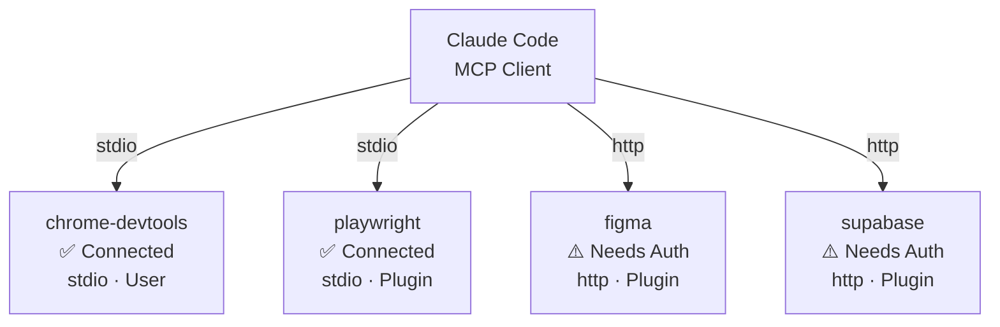

# MCP 管理面板设计规格

> 日期: 2026-04-16
> 状态: Final
> 范围: Polaris 桌面客户端新增 MCP 服务器管理功能

---

## 1. 概述

### 1.1 目标

为 Polaris 提供 MCP（Model Context Protocol）服务器的可视化管理能力，让用户无需命令行操作即可查看所有 MCP 服务器的连接状态、配置详情、认证状态，并进行添加/移除/认证等操作。

### 1.2 面板定位

- **左侧面板**：独立 Tab（与 files/git/todo 并列），展示服务器卡片网格 + 状态总览 + 连接管理
- **Settings Tab**：MCP 配置面板，展示配置层级 Mermaid 图 + 可编辑服务器列表 + 添加/移除操作

### 1.3 分阶段交付

| Phase | 功能 | 优先级 |
|-------|------|--------|
| Phase 1 | 只读查看 + 连接管理（刷新/重连） + 健康检查轮询 | 高 |
| Phase 2 | 一键 OAuth 认证 + 添加/移除服务器 | 中 |
| Phase 3 | 服务器能力矩阵（工具列表） + 配置范围层级图 | 低 |

---

## 2. 架构方案：Service 层驱动

```
Frontend (React)                    Rust Backend (Tauri)
┌──────────────────────┐            ┌──────────────────────────┐
│ McpPanel (左侧面板)   │            │ mcp_manager_service.rs    │
│ McpSettingsTab        │──invoke──►│ ├─ list_configs()         │
│                       │           │ ├─ get_config(name)       │
│ mcpStore (Zustand)    │           │ ├─ health_check()         │
│ ├─ servers[]          │◄──result──│ ├─ health_check_one(name) │
│ ├─ loading/error      │           │ ├─ add_server()           │
│ └─ actions            │           │ ├─ remove_server(name)    │
│                       │           │ └─ start_auth(name)       │
└──────────────────────┘            └──────────────────────────┘
       │                                      │
       │                              ┌───────┴────────┐
       │                              │                 │
       │                          配置文件读取      CLI 健康检查
       │                          (多文件合并)     (claude mcp list)
       │                              │                 │
       │                              ▼                 ▼
       │                     聚合为 McpServerAggregate
       │                     返回给前端渲染
       ▼
  McpServerCard × N
  McpServerDetail
  McpTopologyDiagram (Mermaid)
```

选择理由：
- 与项目现有 pluginStore / requirementStore 模式一致
- 后端做文件读取和 CLI 调用，前端不接触解析逻辑
- 关注点分离：配置读取、健康检查、CRUD 操作各自独立

---

## 3. 数据模型

### 3.1 Rust 后端

```rust
/// MCP 传输类型
#[derive(Serialize, Deserialize, Clone, Debug)]
#[serde(rename_all = "lowercase")]
pub enum McpTransport {
    Stdio,
    Sse,
    Http,
}

/// MCP 配置范围
#[derive(Serialize, Deserialize, Clone, Debug)]
#[serde(rename_all = "lowercase")]
pub enum McpScope {
    Local,
    User,
    Project,
    Plugin,
}

/// 单个 MCP 服务器的配置信息
#[derive(Serialize, Deserialize, Clone, Debug)]
pub struct McpServerInfo {
    pub name: String,
    pub command_or_url: String,
    pub args: Vec<String>,
    pub transport: McpTransport,
    pub scope: McpScope,
    pub env: HashMap<String, String>,
}

/// 健康检查结果
#[derive(Serialize, Deserialize, Clone, Debug)]
pub struct McpHealthStatus {
    pub name: String,
    pub connected: bool,
    pub needs_auth: bool,
    pub error: Option<String>,
    pub checked_at: String, // ISO 8601
}

/// 前端消费的聚合视图
#[derive(Serialize, Deserialize, Clone, Debug)]
pub struct McpServerAggregate {
    pub info: McpServerInfo,
    pub health: Option<McpHealthStatus>,
    pub tools: Vec<String>, // Phase 3
}

/// Phase 2: 添加服务器请求
#[derive(Deserialize, Debug)]
pub struct McpAddRequest {
    pub name: String,
    pub command_or_url: String,
    pub args: Vec<String>,
    pub transport: McpTransport,
    pub scope: McpScope,
    pub env: HashMap<String, String>,
}
```

### 3.2 前端 TypeScript

```ts
// src/types/mcp.ts

export type McpTransport = 'stdio' | 'sse' | 'http'
export type McpScope = 'local' | 'user' | 'project' | 'plugin'

export interface McpServerInfo {
  name: string
  commandOrUrl: string
  args: string[]
  transport: McpTransport
  scope: McpScope
  env: Record<string, string>
}

export interface McpHealthStatus {
  name: string
  connected: boolean
  needsAuth: boolean
  error: string | null
  checkedAt: string // ISO 8601
}

export interface McpServerAggregate {
  info: McpServerInfo
  health: McpHealthStatus | null
  tools: string[]
}

export type McpStatusFilter = 'all' | 'connected' | 'needsAuth' | 'disconnected'
```

设计决策：
- **配置与状态分离** — McpServerInfo 来自配置文件（稳定），McpHealthStatus 来自 CLI（动态），通过 name 关联
- **Aggregate 模式** — 前端只消费 McpServerAggregate，后端负责拼接
- **Scope 包含 plugin** — 已有 4 个 plugin scope 的 MCP（figma/playwright/supabase/superpowers）

---

## 4. Rust 后端 Service

### 4.1 文件结构

```
src-tauri/src/
├── services/
│   ├── mcp_manager_service.rs    ← 新建，MCP 管理核心 service
│   ├── mcp_config_service.rs     ← 已有，保留不动
│   └── mcp_diagnostics_service.rs ← 已有，保留不动
├── commands/
│   ├── mcp_manager.rs            ← 新建，Tauri commands
│   └── diagnostics.rs            ← 已有，保留不动
└── lib.rs                        ← 注册新 commands
```

### 4.2 McpManagerService 职责

```rust
pub struct McpManagerService {
    claude_path: String,
    app_handle: AppHandle,
}

impl McpManagerService {
    /// 读取所有 scope 的 MCP 配置文件，合并去重
    pub fn list_configs(&self, workspace_path: &Path) -> Result<Vec<McpServerInfo>>;

    /// 获取单个服务器配置
    pub fn get_config(&self, name: &str, workspace_path: &Path) -> Result<McpServerInfo>;

    /// 调用 `claude mcp list`，解析输出获取健康状态
    pub fn health_check(&self) -> Result<Vec<McpHealthStatus>>;

    /// 调用 `claude mcp get <name>`，单个服务器健康状态
    pub fn health_check_one(&self, name: &str) -> Result<McpHealthStatus>;

    /// 聚合：配置 + 健康检查
    pub fn list_servers(&self, workspace_path: &Path) -> Result<Vec<McpServerAggregate>>;

    /// 聚合：单个服务器配置 + 健康状态
    pub fn get_server(&self, name: &str, workspace_path: &Path) -> Result<McpServerAggregate>;

    /// Phase 2: 添加服务器
    pub fn add_server(&self, req: McpAddRequest) -> Result<()>;

    /// Phase 2: 移除服务器
    pub fn remove_server(&self, name: &str, scope: Option<McpScope>) -> Result<()>;

    /// Phase 2: 启动 OAuth 认证
    pub fn start_auth(&self, name: &str) -> Result<()>;
}
```

### 4.3 配置文件读取策略

读取优先级（从低到高）：

1. `~/.claude/settings.json` — user scope
2. `<project>/.mcp.json` — project scope
3. `<project>/.claude/settings.json` — project scope
4. `<project>/.claude/settings.local.json` — local scope
5. 插件注入 — plugin scope（从 plugin 配置中提取）

合并策略：
- 同名服务器高优先级覆盖，保留 scope 标记
- 按 name 去重，保留最高优先级的配置
- 解析失败的单个文件跳过，记录 warn 日志，返回已成功解析的部分

配置文件中的 MCP 结构（参考现有 `McpServerConfig` 类型）：

```json
{
  "mcpServers": {
    "chrome-devtools": {
      "command": "cmd",
      "args": ["/c", "npx", "chrome-devtools-mcp@latest"],
      "type": "stdio"
    }
  }
}
```

### 4.4 健康检查解析

`claude mcp list` 输出格式：

```
plugin:figma:figma: https://mcp.figma.com/mcp (HTTP) - ! Needs authentication
chrome-devtools: cmd /c npx chrome-devtools-mcp@latest - ✓ Connected
```

解析规则：
- 格式为 `<name>: <command_or_url> [(<transport>)] - <status>`
- name 是第一个 `: `（冒号+空格）之前的全部内容，可能包含冒号（如 `plugin:figma:figma`）
- `()` 内提取 transport：`HTTP` → Http，无括号 → Stdio
- ` - ` 分割右侧为状态部分
- `✓ Connected` → `{ connected: true, needs_auth: false }`
- `! Needs authentication` → `{ connected: false, needs_auth: true }`
- `✗ <error>` → `{ connected: false, error: "<error>" }`

`claude mcp get <name>` 输出格式：

```
chrome-devtools:
  Scope: User config (available in all your projects)
  Status: ✓ Connected
  Type: stdio
  Command: cmd
  Args: /c npx chrome-devtools-mcp@latest
  Environment:
```

逐行正则匹配提取各字段。

### 4.5 Tauri Commands

```rust
// Phase 1
#[tauri::command]
async fn mcp_list_servers(
    workspace_path: String,
    state: State<'_, AppState>,
) -> Result<Vec<McpServerAggregate>, String>;

#[tauri::command]
async fn mcp_get_server(
    name: String,
    workspace_path: String,
    state: State<'_, AppState>,
) -> Result<McpServerAggregate, String>;

#[tauri::command]
async fn mcp_health_check(
    state: State<'_, AppState>,
) -> Result<Vec<McpHealthStatus>, String>;

#[tauri::command]
async fn mcp_health_check_one(
    name: String,
    state: State<'_, AppState>,
) -> Result<McpHealthStatus, String>;

// Phase 2
#[tauri::command]
async fn mcp_add_server(
    request: McpAddRequest,
    state: State<'_, AppState>,
) -> Result<(), String>;

#[tauri::command]
async fn mcp_remove_server(
    name: String,
    scope: Option<String>,
    state: State<'_, AppState>,
) -> Result<(), String>;

#[tauri::command]
async fn mcp_start_auth(
    name: String,
    state: State<'_, AppState>,
) -> Result<(), String>;
```

注册到 `lib.rs` 的 `tauri::generate_handler![...]`。

### 4.6 AppState 注册

`McpManagerService` 需注册为 Tauri managed state：

```rust
// lib.rs setup 中添加
let mcp_manager = McpManagerService::new(claude_path.clone(), app_handle.clone());
app_handle.manage(mcp_manager);
```

前端 store 的 `workspacePath` 来源：从 `useWorkspaceStore` 或 `useSessionStore` 获取当前工作区路径，传入 `mcpStore.init()`。

---

## 5. 前端 Store

### 5.1 mcpStore

```ts
// src/stores/mcpStore.ts

interface McpState {
  servers: McpServerAggregate[]
  loading: boolean
  error: string | null
  initialized: boolean
  lastHealthCheck: string | null // ISO timestamp
  statusFilter: McpStatusFilter
  expandedServer: string | null // 展开的卡片 name

  // Actions
  init: (workspacePath: string) => Promise<void>
  refreshAll: () => Promise<void>
  healthCheck: () => Promise<void>
  getServerDetail: (name: string) => Promise<void>
  setStatusFilter: (filter: McpStatusFilter) => void
  toggleExpand: (name: string) => void

  // Phase 2
  addServer: (req: McpAddRequest) => Promise<boolean>
  removeServer: (name: string, scope?: string) => Promise<boolean>
  startAuth: (name: string) => Promise<void>
}
```

### 5.2 Store 实现

- 使用 `createLogger('McpStore')` 记录日志（与 pluginStore 一致）
- `init` 在工作区打开时调用，首次加载配置 + 健康检查
- `refreshAll` 重新读取配置 + 健康检查（全量刷新）
- `healthCheck` 仅刷新健康状态（轻量，适合轮询）
- Action 标准模式：`set({ loading: true, error: null })` → invoke → `set({ data, loading: false })`

### 5.3 健康检查轮询 Hook

```ts
// src/components/Mcp/hooks/useMcpHealthPolling.ts

function useMcpHealthPolling(isVisible: boolean, panelType: string) {
  useEffect(() => {
    if (!isVisible || panelType !== 'mcp') return

    const timer = setInterval(() => {
      mcpStore.getState().healthCheck()
    }, 30_000)

    return () => clearInterval(timer)
  }, [isVisible, panelType])
}
```

条件：左侧面板可见 & 面板类型为 mcp。间隔 30 秒。面板切换或卸载时清理。

---

## 6. 前端组件

### 6.1 文件结构

```
src/components/Mcp/
├── index.ts                        ← 导出
├── McpPanel.tsx                    ← 左侧面板主容器
├── McpServerCard.tsx               ← 单个服务器卡片
├── McpServerDetail.tsx             ← 服务器详情展开区
├── McpSettingsTab.tsx              ← Settings 面板
├── McpTopologyDiagram.tsx          ← Mermaid 拓扑图
└── hooks/
    └── useMcpHealthPolling.ts      ← 健康检查轮询
```

### 6.2 McpPanel（左侧面板主容器）

```
┌─────────────────────────────────────┐
│ 🔌 MCP 服务器          [🔄 刷新]   │
├─────────────────────────────────────┤
│ 状态筛选: [全部|已连接|待认证|断开]   │
├─────────────────────────────────────┤
│                                      │
│ ┌─────────────────────────────────┐ │
│ │ ✅ chrome-devtools    stdio     │ │
│ │    User scope    ● Connected   │ │
│ │    cmd /c npx chrome-devtools..│ │
│ └─────────────────────────────────┘ │
│ ┌─────────────────────────────────┐ │
│ │ ✅ playwright        stdio     │ │
│ │    Plugin scope  ● Connected   │ │
│ └─────────────────────────────────┘ │
│ ┌─────────────────────────────────┐ │
│ │ ⚠️ figma              http     │ │
│ │    Plugin scope  ● Needs Auth  │ │
│ │    [认证]                      │ │  ← Phase 2
│ └─────────────────────────────────┘ │
│ ┌─────────────────────────────────┐ │
│ │ ⚠️ supabase           http     │ │
│ │    Plugin scope  ● Needs Auth  │ │
│ └─────────────────────────────────┘ │
│                                      │
├─────────────────────────────────────┤
│ 4 服务器 · 2 已连接 · 2 待处理      │
└─────────────────────────────────────┘
```

组件结构：
- 顶部：标题 + 刷新按钮
- 筛选栏：`McpStatusFilter` 按钮组
- 内容区：虚拟化卡片列表（react-virtuoso），`McpServerCard` × N
- 底部状态栏：汇总统计
- 空状态：无服务器时显示引导信息
- 错误状态：CLI 未找到 / 网络错误时的提示

### 6.3 McpServerCard（服务器卡片）

每张卡片展示：
- 状态图标：✅ Connected / ⚠️ Needs Auth / ❌ Error / ⏳ Checking
- 服务器名称
- Transport 类型 badge（stdio / http / sse）
- Scope badge（user / project / local / plugin）
- 命令或 URL（截断显示）
- Phase 2: 操作按钮（认证 / 移除）

点击卡片展开 `McpServerDetail`（面板内联展开，非弹窗）。

样式沿用 `McpServerCard`（PluginTab 中）的 Tailwind 类名：
`bg-surface p-3 rounded border border-border-subtle`

### 6.4 McpServerDetail（详情展开区）

展开后显示：
- Command 完整路径
- Args 列表
- 环境变量（脱敏显示）
- Scope 详细信息
- 上次健康检查时间
- Phase 2: 提供的工具列表
- Phase 2: 操作按钮

### 6.5 McpSettingsTab（Settings 面板）

```
┌──────────────────────────────────────────────────┐
│ ⚙️ MCP 服务器配置                                 │
├──────────────────────────────────────────────────┤
│                                                   │
│ 配置层级:                                        │
│ ┌─────────────────────────────────────────────┐  │
│ │  Mermaid graph TB                            │  │
│ │    User Config ──► Project Config            │  │
│ │                   ──► Local Config            │  │
│ │                   ──► Plugin Config           │  │
│ └─────────────────────────────────────────────┘  │
│                                                   │
│ 服务器列表:                                      │
│ ┌─────────┬──────────┬────────┬────────┬───────┐ │
│ │ 名称    │ Transport│ Scope  │ 状态   │ 操作  │ │
│ ├─────────┼──────────┼────────┼────────┼───────┤ │
│ │ chr..   │ stdio   │ user   │ ✅     │ [⚙][🗑]│ │
│ │ pw      │ stdio   │ plugin │ ✅     │ [⚙][🗑]│ │
│ │ figma   │ http    │ plugin │ ⚠️     │ [⚙][🗑]│ │
│ │ supa    │ http    │ plugin │ ⚠️     │ [⚙][🗑]│ │
│ └─────────┴──────────┴────────┴────────┴───────┘ │
│                                                   │
│ [+ 添加服务器]                         Phase 2    │
└──────────────────────────────────────────────────┘
```

### 6.6 McpTopologyDiagram（Mermaid 拓扑图）

动态生成 Mermaid 代码：



根据 servers 数据动态生成 Mermaid 字符串，注入 `McpTopologyDiagram` 组件渲染。

---

## 7. 注册入口

### 7.1 左侧面板

| 文件 | 变更 |
|------|------|
| `src/stores/viewStore.ts` | `LeftPanelType` 添加 `'mcp'` |
| `src/components/Layout/ActivityBar.tsx` | `panelButtons` 添加 `{ id: 'mcp', icon: Cpu, label: t('mcp:panel.title') }` |
| `src/components/Layout/LeftPanel.tsx` | `LeftPanelContent` 添加 `mcp` case 渲染 `McpPanel` |
| `src/App.tsx` | lazy import `McpPanel`，传递 content prop |

### 7.2 Settings Tab

| 文件 | 变更 |
|------|------|
| `src/components/Settings/SettingsSidebar.tsx` | `SettingsTabId` 添加 `'mcp'`，`NAV_ITEMS` 添加条目 |
| `src/components/Settings/SettingsModal.tsx` | `TAB_TITLE_KEYS` 添加条目，条件渲染 `McpSettingsTab` |

### 7.3 Store

| 文件 | 变更 |
|------|------|
| `src/stores/mcpStore.ts` | 新建 |
| `src/stores/index.ts` | 导出 `useMcpStore` |

### 7.4 Types

| 文件 | 变更 |
|------|------|
| `src/types/mcp.ts` | 新建 |

### 7.5 i18n

| 文件 | 变更 |
|------|------|
| `src/locales/zh/mcp.json` | 新建，MCP 面板中文翻译 |
| `src/locales/en/mcp.json` | 新建，MCP 面板英文翻译 |

---

## 8. 数据流

### 8.1 初始化流程

```
工作区打开
    │
    ▼
mcpStore.init(workspacePath)
    │
    ├─► invoke('mcp_list_servers', { workspacePath })
    │        │
    │        ▼
    │   McpManagerService.list_servers()
    │        ├─ read_configs(workspace_path)
    │        │   ├─ ~/.claude/settings.json
    │        │   ├─ .mcp.json
    │        │   ├─ .claude/settings.json
    │        │   ├─ .claude/settings.local.json
    │        │   └─ 插件配置
    │        │        │
    │        │        ▼
    │        │   合并去重 → Vec<McpServerInfo>
    │        │
    │        ├─ health_check()
    │        │   └─ execute_claude(["mcp", "list"])
    │        │        └─ 解析 stdout → Vec<McpHealthStatus>
    │        │
    │        └─ 聚合 → Vec<McpServerAggregate>
    │
    ▼
mcpStore.set({ servers, loading: false, initialized: true })
    │
    ▼
McpPanel 渲染卡片列表
```

### 8.2 健康检查轮询

```
McpPanel mounted & visible
    │
    ▼
useMcpHealthPolling(isVisible, panelType)
    │
    ├─ 每 30s 触发 mcpStore.healthCheck()
    │       │
    │       ▼
    │   invoke('mcp_health_check')
    │       │
    │       ▼
    │   McpManagerService.health_check()
    │       └─ execute_claude(["mcp", "list"])
    │            └─ 解析 → Vec<McpHealthStatus>
    │
    ▼
合并到 servers[].health，UI 更新状态图标
```

### 8.3 详情查看

```
用户点击 McpServerCard
    │
    ▼
mcpStore.toggleExpand(name)
    │
    ▼
卡片展开 → McpServerDetail
    │
    ├─ 已有 health 数据 → 直接展示
    │
    └─ 无 health 数据 → invoke('mcp_health_check_one', { name })
                         → 更新 health 字段
```

### 8.4 Phase 2: 添加服务器

```
用户在 McpSettingsTab 点击 [+ 添加服务器]
    │
    ▼
弹出表单（名称 / 命令或 URL / transport / scope）
    │
    ▼
用户提交 → mcpStore.addServer(req)
    │
    ▼
invoke('mcp_add_server', { request: req })
    │
    ▼
McpManagerService.add_server()
    └─ execute_claude(["mcp", "add", name, commandOrUrl, ...])
    │
    ▼
成功 → mcpStore.refreshAll() 刷新列表
失败 → toast 提示错误
```

---

## 9. 交互流程

### 场景 1: 查看服务器状态

1. 点击 ActivityBar 的 MCP 图标
2. McpPanel 渲染，展示所有服务器卡片
3. 状态筛选器过滤（全部 / 已连接 / 待认证 / 断开）
4. 底部状态栏显示汇总统计
5. 后台每 30 秒自动刷新健康状态

### 场景 2: 查看服务器详情

1. 点击某张 McpServerCard
2. 卡片展开为 McpServerDetail
3. 显示完整 command / args / env / scope / transport
4. 显示最近一次健康检查时间和结果

### 场景 3: 手动刷新

1. 点击右上角 [🔄 刷新]
2. 卡片进入 loading 状态，显示 spinner
3. 调用 healthCheck()
4. 结果返回，卡片状态更新

### 场景 4: 配置层级查看

1. Settings → MCP Tab
2. Mermaid 渲染配置层级图
3. 表格展示完整服务器列表

### 场景 5: 一键认证（Phase 2）

1. 点击 Needs Auth 卡片的 [认证] 按钮
2. 后端启动 OAuth 流程
3. Tauri shell.open() 打开浏览器
4. 等待回调
5. 自动刷新健康状态

---

## 10. 错误处理

| 场景 | 处理 |
|------|------|
| CLI 不在 PATH | `mcpStore.error = "Claude CLI not found"`，面板显示错误提示 |
| 健康检查超时（>10s） | 单个服务器 health 保持 null，不阻塞其他服务器 |
| 配置文件不存在 | 正常情况，返回空列表 |
| 配置文件 JSON 格式错误 | 跳过该文件，记录 warn 日志，返回已成功解析的部分 |
| add/remove CLI 执行失败 | toast 提示错误信息，store 不变更 |
| 网络不通（http 类型 MCP） | `connected: false, error: "connection refused"` |
| 重复 name | 高优先级覆盖低优先级 |

---

## 11. 国际化

新增 i18n namespace：`mcp`

### zh/mcp.json

```json
{
  "panel": {
    "title": "MCP 服务器",
    "refresh": "刷新",
    "empty": "暂无 MCP 服务器",
    "emptyHint": "在 Settings 中添加 MCP 服务器",
    "status": {
      "all": "全部",
      "connected": "已连接",
      "needsAuth": "待认证",
      "disconnected": "断开"
    },
    "summary": "{{total}} 服务器 · {{connected}} 已连接 · {{pending}} 待处理",
    "lastCheck": "上次检查: {{time}}"
  },
  "card": {
    "connected": "已连接",
    "needsAuth": "待认证",
    "disconnected": "已断开",
    "checking": "检查中...",
    "error": "错误",
    "authenticate": "认证",
    "remove": "移除"
  },
  "detail": {
    "command": "命令",
    "args": "参数",
    "env": "环境变量",
    "scope": "范围",
    "transport": "传输类型",
    "lastCheck": "上次检查",
    "tools": "可用工具"
  },
  "settings": {
    "title": "MCP 服务器配置",
    "configLayers": "配置层级",
    "serverList": "服务器列表",
    "addServer": "添加服务器",
    "removeConfirm": "确定移除 {{name}} 吗？",
    "name": "名称",
    "command": "命令或 URL",
    "transport": "传输类型",
    "scope": "配置范围"
  },
  "scope": {
    "local": "本地",
    "user": "用户",
    "project": "项目",
    "plugin": "插件"
  },
  "transport": {
    "stdio": "标准输入输出",
    "sse": "SSE",
    "http": "HTTP"
  },
  "error": {
    "cliNotFound": "未找到 Claude CLI，请确认已安装",
    "healthCheckFailed": "健康检查失败",
    "addFailed": "添加服务器失败",
    "removeFailed": "移除服务器失败",
    "authFailed": "认证失败"
  }
}
```

### en/mcp.json

```json
{
  "panel": {
    "title": "MCP Servers",
    "refresh": "Refresh",
    "empty": "No MCP servers",
    "emptyHint": "Add MCP servers in Settings",
    "status": {
      "all": "All",
      "connected": "Connected",
      "needsAuth": "Needs Auth",
      "disconnected": "Disconnected"
    },
    "summary": "{{total}} servers · {{connected}} connected · {{pending}} pending",
    "lastCheck": "Last check: {{time}}"
  },
  "card": {
    "connected": "Connected",
    "needsAuth": "Needs Auth",
    "disconnected": "Disconnected",
    "checking": "Checking...",
    "error": "Error",
    "authenticate": "Authenticate",
    "remove": "Remove"
  },
  "detail": {
    "command": "Command",
    "args": "Arguments",
    "env": "Environment",
    "scope": "Scope",
    "transport": "Transport",
    "lastCheck": "Last Check",
    "tools": "Available Tools"
  },
  "settings": {
    "title": "MCP Server Configuration",
    "configLayers": "Configuration Layers",
    "serverList": "Server List",
    "addServer": "Add Server",
    "removeConfirm": "Remove {{name}}?",
    "name": "Name",
    "command": "Command or URL",
    "transport": "Transport",
    "scope": "Scope"
  },
  "scope": {
    "local": "Local",
    "user": "User",
    "project": "Project",
    "plugin": "Plugin"
  },
  "transport": {
    "stdio": "Standard I/O",
    "sse": "SSE",
    "http": "HTTP"
  },
  "error": {
    "cliNotFound": "Claude CLI not found. Please install it first.",
    "healthCheckFailed": "Health check failed",
    "addFailed": "Failed to add server",
    "removeFailed": "Failed to remove server",
    "authFailed": "Authentication failed"
  }
}
```

---

## 12. 测试策略

### 后端单元测试

- 配置文件解析：多种格式、合并去重、错误容错
- CLI 输出解析：`mcp list` 和 `mcp get` 的各种输出格式
- 聚合逻辑：配置 + 健康状态的正确合并

### 前端组件测试

- McpPanel 渲染：空状态、正常列表、错误状态
- McpServerCard：不同状态的正确渲染
- 筛选逻辑：按状态过滤
- Store actions：mock invoke，验证状态变更

### 集成测试

- 真实环境下 CLI 调用和解析
- 健康检查轮询的启停
